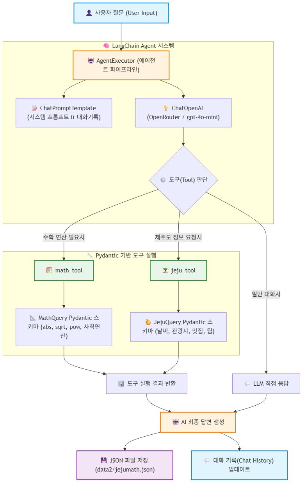
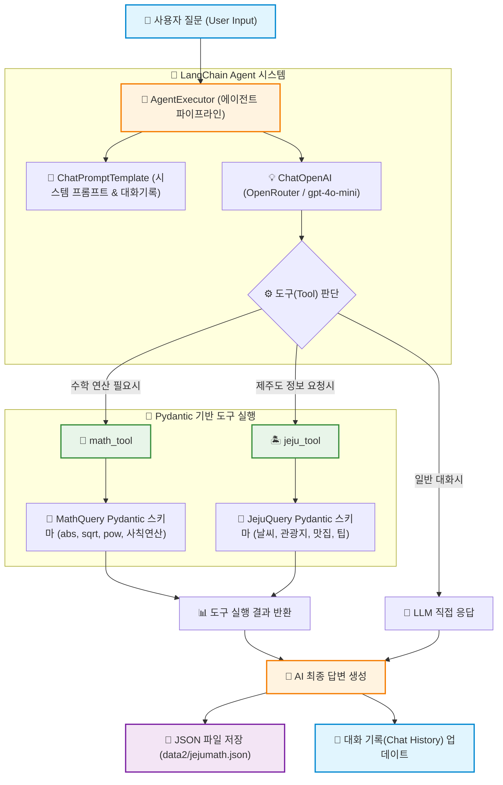
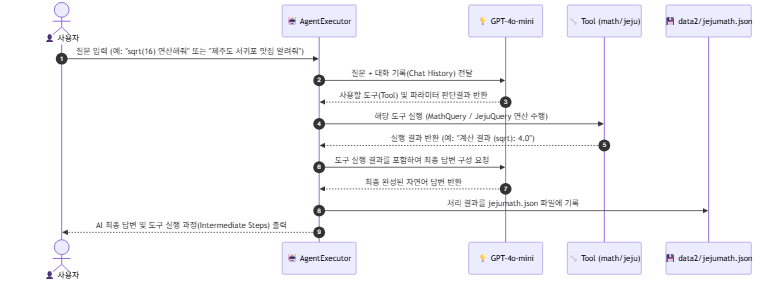
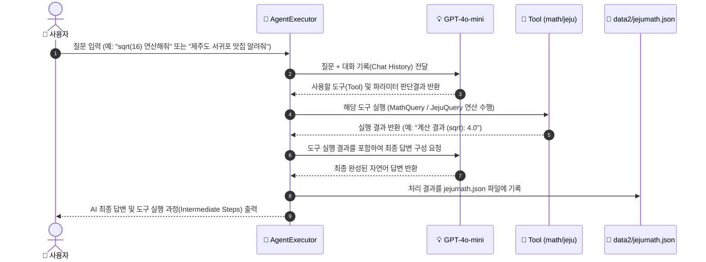

# 🌴 mymathjeju.py 코드 구조 및 실행 흐름도 (Structure Guide)

이 문서는 `mymathjeju.py` 파일의 전체적인 구조와 동작 방식을 초보자도 쉽게 이해할 수 있도록 요약한 설명서입니다.  
LangChain 에이전트(`AgentExecutor`)가 사용자의 질문을 분석하여 **수학 연산 도구(Math Tool)** 또는 **제주도 안내 도구(Jeju Tool)**를 자율적으로 선택하고 결과를 저장하는 전체 파이프라인을 다룹니다.

---

## 1. 🏗️ 전체 시스템 구조도 (System Architecture)

---

## 2. 🧩 주요 구성 요소 설명 (Key Components)

| 구성 요소 (Component) | 역할 (Role) | 주요 기능 및 설명 |
| :--- | :--- | :--- |
| **0. JSON 저장소 (`save_to_jejumath_json`)** | 결과 데이터 로깅 | 질문 일시, 사용자 질문, AI 답변을 `data2/jejumath.json` 파일에 자동 누적 기록 |
| **1. Pydantic 스키마 (`MathQuery`, `JejuQuery`)** | 입력 데이터 검증 및 연산 | 도구에 전달되는 입력 파라미터를 검증하고, 파이썬 내장 연산자/math 모듈(`abs`, `sqrt`, `pow`, `round` 등) 및 제주도 가이드 데이터 처리 |
| **2. LangChain 도구 (`math_tool`, `jeju_tool`)** | `@tool` 데코레이터 적용 | Pydantic 스키마와 결합하여 AI 모델이 인식할 수 있는 전용 도구(Tool)로 등록 |
| **3. 에이전트 파이프라인 (`create_agent_pipeline`)** | AI 모델 & 에이전트 생성 | OpenRouter 기반 `gpt-4o-mini` 모델과 도구, 대화 기록 프롬프트를 연결하여 `AgentExecutor` 생성 |
| **4. 실행 프로세스 (`process_query`)** | CLI 처리 & 대화 관리 | 사용자 질문 처리, intermediate_steps(도구 중간 실행 로그) 출력, JSON 저장 및 세션 기억 관리 |

---

## 3. 🔄 데이터 실행 흐름 (Execution Step-by-Step)

---

## 4. 💡 초보자를 위한 핵심 포인트 (Summary for Beginners)

1. **AI가 도구를 스스로 선택합니다 (Autonomous Agent)**:
   - 사용자가 수학 질문을 하면 `math_tool`을 호출하고, 제주 여행 질문을 하면 `jeju_tool`을 자동으로 판단해서 실행합니다.
2. **Pydantic 스키마로 정확성을 높였습니다**:
   - AI가 생성한 인자가 지정된 데이터 타입(숫자, 문자열 등)에 맞는지 검증하고 연산을 안전하게 실행합니다.
3. **대화 내용과 결과가 자동 기록됩니다**:
   - 이전 질문을 기억하기 위한 `chat_history` 세션 관리와 함께, 처리된 모든 질의응답 내역이 `data2/jejumath.json` 파일에 저장되어 기록으로 남습니다.
